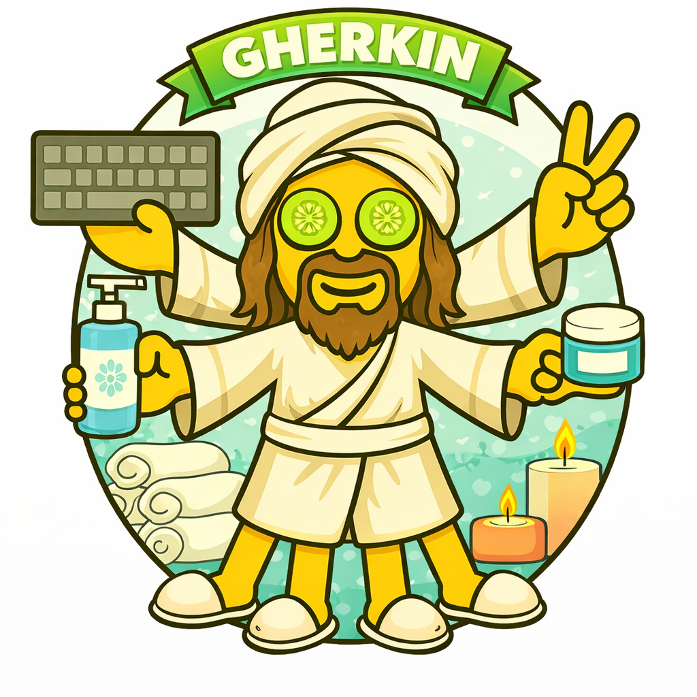

# Belize

## Why Belize

- **B**DD + **L**isa + **E**ric = Belize
- Catchy and weird, like Katmandu, so you don't pretend to know what it is
- Liz (BDD Discovery, `/3-amigos`) feeds Belize
- Lisa and Eric are the BDD execution layer
- The whole BDD family lives in the name

## Background

This loop implements the acceptance layer of **ATDD (Acceptance Test-Driven Development)** - writing acceptance tests before code, from the user's perspective.

**Kent Beck** gave us TDD - red, green, refactor at the unit level. **Dan North** (2006) reframed it as BDD - behavior over tests, examples over assertions. **Gherkin** emerged from BDD and Cucumber as a structured plain-language syntax that both humans and test frameworks can read.

**ATDD** sits above both. Where TDD drives code design and BDD drives behavior, ATDD drives the whole feature from acceptance criteria down. The tests are written first, at the outermost layer, and development works **outside-in**.

### Key references

- [Dan North: Introducing BDD](https://dannorth.net/introducing-bdd/)
- [Cucumber: Gherkin Reference](https://cucumber.io/docs/gherkin/)
- [Cucumber (Ruby)](https://cucumber.io/docs/cucumber/)
- [Agile Alliance: ATDD](https://agilealliance.org/glossary/atdd/)
- [Outside-In TDD](https://outsidein.dev/concepts/outside-in-tdd/)

## How It Fits

The middle ring of DDD (Dude-Driven Development):

- **3-amigos** (`/3-amigos`) - discover WHAT: examples, rules, questions
- **Belize** (`/belize`) - write acceptance scenarios from those examples
- **Katmandu** (`/katmandu`) - implement code outside-in to make scenarios pass

3-amigos produces the plan. Belize turns it into executable scenarios. When a scenario is red, Katmandu takes over - then Belize verifies it's green and moves to the next scenario.

## The Cast

### lisa

- Named after [Lisa Crispin](https://lisacrispin.com) - Agile Testing, business-facing tests
- Persistent team member (Sonnet) - keeps context across all scenarios in a feature
- Owns the `.feature` files, step definitions, `@wip` and `@pending` tags
- Gets better each round because she remembers prior feedback

### eric (ephemeral)

- Named after [Eric Evans](https://www.domainlanguage.com) - Domain-Driven Design, ubiquitous language
- NOT a team member - spawned fresh for each review, dies after feedback
- Reviews scenarios and step definitions for domain language alignment
- Fresh eyes every time - no accumulated bias

## Double Dispatch

Belize uses a global + local pattern:

- **Global skill** (`~/.claude/skills/belize/`) defines the process, the cast, the loop
- **Local skill** (`.claude/skills/belize/` per project) defines the DSL, step definitions, domain rules
- Each references the other, the agent reads both
