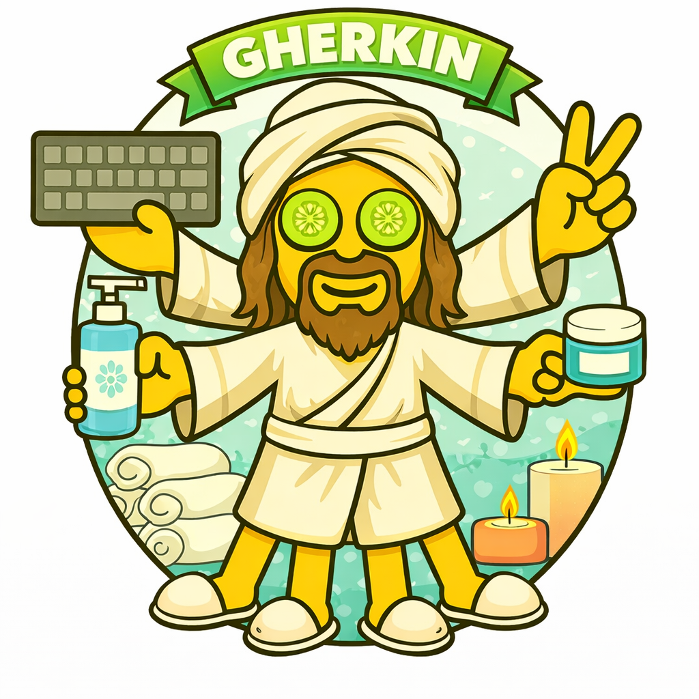

# Gherkin Loop for AI Agents

## Background

This loop implements the acceptance layer of **ATDD (Acceptance Test-Driven Development)** — writing acceptance tests before code, from the user's perspective.

**Kent Beck** gave us TDD — red, green, refactor at the unit level. **Dan North** (2006) reframed it as BDD — behavior over tests, examples over assertions. **Gherkin** emerged from BDD and Cucumber as a structured plain-language syntax (Given-When-Then) that both humans and test frameworks can read. The name comes from the pickled cucumber metaphor — preserving requirements in a digestible format.

**ATDD** sits above both. Where TDD drives code design and BDD drives behavior, ATDD drives the whole feature from acceptance criteria down. The tests are written first, at the outermost layer, and development works **outside-in** — from the acceptance test inward through the code. This is the key insight: acceptance tests aren't verification after the fact, they're the design tool that shapes what gets built.

### Key references

- [Dan North: Introducing BDD](https://dannorth.net/introducing-bdd/)
- [Cucumber: Gherkin Reference](https://cucumber.io/docs/gherkin/)
- [Agile Alliance: ATDD](https://agilealliance.org/glossary/atdd/)
- [Outside-In TDD](https://outsidein.dev/concepts/outside-in-tdd/)

## How It Fits

The Gherkin loop is the middle ring of DDD (Dude-Driven Development):

1. **Three Amigos** (`/three-amigos`) — discover WHAT: examples, rules, questions
2. **Gherkin** (`/gherkin`) — write acceptance scenarios and step definitions from those examples
3. **Katmandu** (`/katmandu`) — implement code outside-in to make scenarios pass

Three Amigos produces the plan. Gherkin turns it into executable scenarios. When a scenario is red, Katmandu takes over to write the production code — then Gherkin verifies it's green and moves to the next scenario.

## The Cast

### lisa

- Named after [Lisa Crispin](https://lisacrispin.com) — Agile Testing, business-facing tests
- Persistent team member (Sonnet) — keeps context across all scenarios in a feature
- Owns the `.feature` files, step definitions, `@wip` and `pending` conventions
- Gets better each round because she remembers prior feedback

### eric (ephemeral)

- Named after [Eric Evans](https://www.domainlanguage.com) — Domain-Driven Design, ubiquitous language
- NOT a team member — spawned fresh for each review, dies after feedback
- Reviews scenarios and step definitions for domain language alignment
- Fresh eyes every time — no accumulated bias
